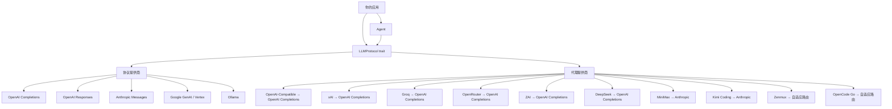

<div align="center">

# tiycore

**统一 LLM API 与有状态 Agent 运行时 (Rust)**

[](https://opensource.org/licenses/MIT)
[](https://www.rust-lang.org/)
[](https://github.com/tiylabs/tiycore)

[English](./README.md) | [中文](./README-ZH.md)

</div>

---

tiycore 是一个 Rust 库，提供统一的、与提供商无关的流式 LLM 补全接口，以及自主的 Agent 工具调用循环。只需编写一次应用逻辑，即可通过修改配置在 OpenAI、Anthropic、Google、Ollama 及 9+ 个其他提供商之间自由切换。


## 核心特性

- **一套接口，多个提供商** — 5 个协议级实现（OpenAI Completions、OpenAI Responses、Anthropic Messages、Google Generative AI / Vertex AI、Ollama）和 10 个代理提供商（OpenAI-Compatible、xAI、Groq、OpenRouter、DeepSeek、MiniMax、Kimi Coding、ZAI、Zenmux、OpenCode Go），统一在单一 `LLMProtocol` trait 之下。
- **流式优先** — `EventStream<T, R>` 基于 `parking_lot::Mutex<VecDeque>` + `tokio::sync::Notify` 实现 `futures::Stream`。每个提供商返回 `AssistantMessageEventStream`，包含细粒度的增量事件：文本、思维链、工具调用参数和完成事件。
- **工具 / 函数调用** — 通过 JSON Schema 定义工具，使用 `jsonschema` crate 验证参数，支持在 Agent 循环中并行或串行执行工具。
- **有状态 Agent 运行时** — `Agent` 管理完整对话循环：流式 LLM → 检测工具调用 → 执行工具 → 重新请求 → 循环。支持引导中断（steering）、后续消息队列、事件订阅（观察者模式）、中止操作，以及可配置的最大轮次（默认 25）。
- **扩展思维链** — 提供商特定的思维/推理支持，统一的 `ThinkingLevel` 枚举（Off → XHigh，支持 OpenAI GPT-5 和 Anthropic Opus 4.7+）以及 `ThinkingDisplay` 枚举（`Summarized` / `Omitted`）用于控制是否在响应中包含思维内容。跨提供商的思维块转换在消息变换中自动处理。
- **默认线程安全** — 所有可变状态使用 `parking_lot` 锁和 `AtomicBool`，无中毒语义的并发设计。

## 架构



### 核心层

| 层 | 路径 | 职责 |
|---|---|---|
| **Types** | `src/types/` | 与提供商无关的数据模型：`Message`、`ContentBlock`、`Model`、`Tool`、`Context`、`SecurityConfig` |
| **Protocol** | `src/protocol/` | 线路格式实现（[完整文档](./src/protocol/README.md)） |
| **Provider** | `src/provider/` | 服务商门面（[完整文档](./src/provider/README.md)） |
| **Stream** | `src/stream/` | 通用 `EventStream<T, R>`，实现 `futures::Stream` |
| **Agent** | `src/agent/` | 有状态对话管理器，含工具执行循环（[完整文档](./src/agent/README.md)） |
| **Transform** | `src/transform/` | 跨提供商消息变换（思维块转换、工具调用 ID 规范化、孤儿工具调用处理） |
| **Thinking** | `src/thinking/` | `ThinkingLevel` 枚举、`ThinkingDisplay` 枚举及提供商特定的思维选项 |
| **Validation** | `src/validation/` | 工具参数 JSON Schema 验证 |
| **Models** | `src/models/` | `ModelRegistry`，内置预定义模型（GPT-4o、Claude Sonnet 4、Gemini 2.5 Flash 等） |
| **Catalog** | `src/catalog/` | 原生模型列表抓取、快照刷新，以及面向展示的元数据补全（[完整文档](./src/catalog/README.md)） |

## 快速开始

在 `Cargo.toml` 中添加依赖：

```toml
[dependencies]
tiycore = "0.1.0"
tokio = { version = "1", features = ["full"] }
futures = "0.3"
```

在正式发布前，本地联调仍可使用：

```toml
[dependencies]
tiycore = { path = "../tiycore" }
```

### 流式补全

```rust
use futures::StreamExt;
use tiycore::{
    provider::get_provider,
    types::*,
};

#[tokio::main]
async fn main() {
    // 构建模型
    let model = Model::builder()
        .id("gpt-4o-mini")
        .name("GPT-4o Mini")
        .provider(Provider::OpenAI)
        .context_window(128000)
        .max_tokens(16384)
        .build()
        .unwrap();

    // 创建包含消息的上下文
    let context = Context {
        system_prompt: Some("You are a helpful assistant.".to_string()),
        messages: vec![Message::User(UserMessage::text("法国的首都是什么？"))],
        tools: None,
    };

    // 从 model 解析提供商并流式获取响应
    // （提供商在首次访问时自动注册 — 无需手动设置）
    let provider = get_provider(&model.provider).unwrap();
    let options = StreamOptions {
        api_key: Some(std::env::var("OPENAI_API_KEY").unwrap()),
        ..Default::default()
    };
    let mut stream = provider.stream(&model, &context, options);

    while let Some(event) = stream.next().await {
        match event {
            AssistantMessageEvent::TextDelta { delta, .. } => print!("{delta}"),
            AssistantMessageEvent::Done { message, .. } => {
                println!("\n--- 输入 {} tokens，输出 {} tokens ---",
                    message.usage.input, message.usage.output);
            }
            AssistantMessageEvent::Error { error, .. } => {
                eprintln!("错误: {:?}", error.error_message);
            }
            _ => {}
        }
    }
}
```

### Agent 工具调用

```rust
use tiycore::{
    agent::{Agent, AgentTool, AgentToolResult},
    types::*,
};

#[tokio::main]
async fn main() {
    let agent = Agent::with_model(
        Model::builder()
            .id("gpt-4o-mini").name("GPT-4o Mini")
            .provider(Provider::OpenAI)
            .context_window(128000).max_tokens(16384)
            .build().unwrap(),
    );

    agent.set_api_key(std::env::var("OPENAI_API_KEY").unwrap());
    agent.set_system_prompt("你是一个有工具访问权限的助手。");
    agent.set_tools(vec![AgentTool::new(
        "get_weather", "获取天气", "获取指定城市的当前天气",
        serde_json::json!({
            "type": "object",
            "properties": { "city": { "type": "string", "description": "城市名称" } },
            "required": ["city"]
        }),
    )]);
    agent.set_tool_executor_simple(|name, _id, args| {
        let name = name.to_string();
        let args = args.clone();
        async move {
            match name.as_str() {
                "get_weather" => {
                    let city = args["city"].as_str().unwrap_or("未知");
                    AgentToolResult::text(format!("{city} 的天气：22°C，晴"))
                }
                _ => AgentToolResult::error(format!("未知工具: {name}")),
            }
        }
    });

    // Agent 自动循环：LLM → 工具调用 → 执行 → 重新请求 → 直至完成
    let messages = agent.prompt("东京的天气怎么样？").await.unwrap();
    println!("Agent 产生了 {} 条消息", messages.len());
}
```

Agent 还支持钩子（beforeToolCall / afterToolCall / onPayload）、上下文管道（transformContext / convertToLlm）、事件订阅、引导 / 后续消息队列、思维链预算、自定义 HTTP 头（`AgentConfig` 的 `custom_headers` 字段）、自定义消息等更多能力。详见 **[Agent 模块完整文档](./src/agent/README.md)**。

## 支持的提供商

| 提供商 | 类型 | 环境变量 |
|---|---|---|
| OpenAI | 直接 | `OPENAI_API_KEY` |
| Anthropic | 直接 | `ANTHROPIC_API_KEY` |
| Google | 直接 | `GOOGLE_API_KEY` |
| Ollama | 直接 | — |
| OpenAI-Compatible | 委托 → OpenAI Completions | `OPENAI_API_KEY` |
| xAI | 委托 → OpenAI Completions | `XAI_API_KEY` |
| Groq | 委托 → OpenAI Completions | `GROQ_API_KEY` |
| OpenRouter | 委托 → OpenAI Completions | `OPENROUTER_API_KEY` |
| ZAI | 委托 → OpenAI Completions | `ZAI_API_KEY` |
| DeepSeek | 委托 → OpenAI Completions | `DEEPSEEK_API_KEY` |
| MiniMax | 委托 → Anthropic | `MINIMAX_API_KEY` |
| Kimi Coding | 委托 → Anthropic | `KIMI_API_KEY` |
| Zenmux | 自适应多协议 | `ZENMUX_API_KEY` |
| OpenCode Go | 自适应多协议 | `OPENCODE_GO_API_KEY` |

关于提供商配置详情、兼容性标志、Zenmux 自适应路由及如何添加新提供商，请参见 **[Provider 完整文档](./src/provider/README.md)**。

关于线路格式协议内部原理（SSE 解析、请求构建、委托宏），请参见 **[Protocol 完整文档](./src/protocol/README.md)**。

## 发布

如果希望其他项目通过版本号依赖 `tiycore`，而不是填写 Git 仓库地址，需要先将该 crate 发布到 crates.io：

```bash
cargo login
cargo package
cargo publish
```

发布完成后，使用方即可直接这样写：

```toml
[dependencies]
tiycore = "0.1.0"
```

## API Key 解析优先级

Key 按以下优先级解析：

1. `StreamOptions.api_key`（逐请求覆盖）
2. 提供商的 `default_api_key()` 方法
3. 环境变量（如 `OPENAI_API_KEY`、`ANTHROPIC_API_KEY`）

Base URL 遵循相同模式：`StreamOptions.base_url` > `model.base_url` > 提供商的 `DEFAULT_BASE_URL`。

## 安全配置

tiycore 内置了集中式 `SecurityConfig` 结构体，统一管理所有安全限制和策略。每个字段都有安全的默认值 — 你只需覆盖想要修改的部分。

### 启用安全配置

**代码中使用（编程方式）：**

```rust
use tiycore::types::{SecurityConfig, HttpLimits, AgentLimits, StreamOptions};

// 方式一：使用默认值（零配置）
let options = StreamOptions::default();
// options.security 为 None → 自动使用所有默认值

// 方式二：覆盖特定值
let security = SecurityConfig::default()
    .with_http(HttpLimits {
        connect_timeout_secs: 10,
        request_timeout_secs: 600,
        ..Default::default()
    })
    .with_agent(AgentLimits {
        max_messages: 500,
        max_parallel_tool_calls: 8,
        ..Default::default()
    });

let options = StreamOptions {
    api_key: Some("sk-...".to_string()),
    security: Some(security),
    ..Default::default()
};
```

**从 JSON 配置文件加载：**

```rust
use tiycore::types::SecurityConfig;

// 从文件加载 — 仅覆盖指定字段，其余使用默认值
let json = std::fs::read_to_string("security.json").unwrap();
let security: SecurityConfig = serde_json::from_str(&json).unwrap();
```

**从 TOML 配置文件加载（需要 `toml` crate）：**

```rust
let toml_str = std::fs::read_to_string("security.toml").unwrap();
let security: SecurityConfig = toml::from_str(&toml_str).unwrap();
```

### JSON 配置参考

完整的 `security.json`，包含所有字段及其默认值：

```jsonc
{
  // HTTP 客户端和 SSE 流解析限制（每次 Provider 请求时生效）
  "http": {
    "connect_timeout_secs": 30,           // TCP 连接超时（秒）
    "request_timeout_secs": 1800,         // 请求总超时，含流式传输（30 分钟）
    "max_sse_line_buffer_bytes": 2097152, // SSE 行缓冲区上限，防止 OOM（2 MiB）
    "max_error_body_bytes": 65536,        // 错误响应体最大读取字节数（64 KiB）
    "max_error_message_chars": 4096       // 存入事件的错误消息最大字符数
  },

  // Agent 运行时限制
  "agent": {
    "max_messages": 1000,                 // 对话历史上限（0 = 无限，超出后 FIFO 丢弃最旧消息）
    "max_parallel_tool_calls": 16,        // 并行工具执行上限
    "tool_execution_timeout_secs": 120,   // 单次工具执行超时（2 分钟）
    "validate_tool_calls": true,          // 执行前是否校验工具参数的 JSON Schema
    "max_subscriber_slots": 128           // 最大事件订阅者槽位数
  },

  // EventStream 基础设施限制
  "stream": {
    "max_event_queue_size": 10000,        // 事件队列缓冲上限（0 = 无限）
    "result_timeout_secs": 600            // EventStream::result() 阻塞超时（10 分钟）
  },

  // 请求头安全策略 — 防止自定义 Header 覆盖认证头
  "headers": {
    "protected_headers": [
      "authorization",
      "x-api-key",
      "x-goog-api-key",
      "anthropic-version",
      "anthropic-beta"
    ]
  },

  // Base URL 验证策略（SSRF 防护）
  "url": {
    "require_https": true,                // 强制 HTTPS（localhost/127.0.0.1 豁免）
    "block_private_ips": false,           // 是否阻止私有/回环 IP（默认关闭，方便本地开发）
    "allowed_schemes": ["https", "http"], // 允许的 URL scheme
    "https_exempt_hosts": []              // 豁免 HTTPS 要求的主机名（如 [".oa.com", "llm.internal"]）
  }
}
```

> **部分覆盖：** 你只需包含想要修改的字段，省略的字段和整个 section 会自动使用默认值。例如 `{}` 表示全部使用默认值，`{"http": {"connect_timeout_secs": 10}}` 只修改连接超时。

### TOML 配置参考

同样的配置，TOML 格式：

```toml
[http]
connect_timeout_secs = 30
request_timeout_secs = 1800
max_sse_line_buffer_bytes = 2097152
max_error_body_bytes = 65536
max_error_message_chars = 4096

[agent]
max_messages = 1000
max_parallel_tool_calls = 16
tool_execution_timeout_secs = 120
validate_tool_calls = true
max_subscriber_slots = 128

[stream]
max_event_queue_size = 10000
result_timeout_secs = 600

[headers]
protected_headers = [
  "authorization",
  "x-api-key",
  "x-goog-api-key",
  "anthropic-version",
  "anthropic-beta",
]

[url]
require_https = true
block_private_ips = false
allowed_schemes = ["https", "http"]
https_exempt_hosts = []
```

### 默认值速查表

| 分组 | 字段 | 默认值 | 说明 |
|---|---|---|---|
| **http** | `connect_timeout_secs` | `30` | TCP 连接超时 |
| | `request_timeout_secs` | `1800` | 请求总超时（30 分钟） |
| | `max_sse_line_buffer_bytes` | `2097152` | SSE 缓冲区上限（2 MiB） |
| | `max_error_body_bytes` | `65536` | 错误响应体读取上限（64 KiB） |
| | `max_error_message_chars` | `4096` | 错误消息截断长度 |
| **agent** | `max_messages` | `1000` | 历史消息上限（0 = 无限） |
| | `max_parallel_tool_calls` | `16` | 并行工具执行上限 |
| | `tool_execution_timeout_secs` | `120` | 单工具超时（2 分钟） |
| | `validate_tool_calls` | `true` | JSON Schema 校验 |
| | `max_subscriber_slots` | `128` | 订阅者槽位 |
| **stream** | `max_event_queue_size` | `10000` | 事件队列上限（0 = 无限） |
| | `result_timeout_secs` | `600` | Result 阻塞超时（10 分钟） |
| **headers** | `protected_headers` | `["authorization", ...]` | 不可被覆盖 |
| **url** | `require_https` | `true` | 强制 HTTPS（localhost 豁免） |
| | `block_private_ips` | `false` | 私有 IP 阻断 |
| | `allowed_schemes` | `["https", "http"]` | 允许的 URL scheme |
| | `https_exempt_hosts` | `[]` | 豁免 HTTPS 的主机名（支持前缀点号后缀匹配） |

## 构建与测试

```bash
cargo build                          # 构建库
cargo test                           # 运行所有测试
cargo test test_agent_state_new      # 按名称运行单个测试
cargo test -- --nocapture            # 显示测试输出
cargo fmt                            # 格式化代码
cargo clippy                         # 代码检查

# 运行示例（需要 API Key）
cargo run --example basic_usage
cargo run --example agent_example
```

## 项目结构

```
src/
├── lib.rs              # Crate 根，公共 re-exports
├── types/              # 与提供商无关的数据模型
│   ├── model.rs        # Model, Provider, Api（通过 define_string_enum! 宏生成）, Cost, OpenAICompletionsCompat（CompatCapabilities, CompatThinking, CompatMessageFormat）
│   ├── message.rs      # Message (User/Assistant/ToolResult), StopReason
│   ├── content.rs      # ContentBlock (Text/Thinking/ToolCall/Image)
│   ├── context.rs      # Context, Tool, StreamOptions
│   ├── limits.rs       # SecurityConfig, HttpLimits, AgentLimits, StreamLimits, UrlPolicy, HeaderPolicy
│   ├── events.rs       # AssistantMessageEvent（流式事件）
│   └── usage.rs        # Token 用量追踪
├── protocol/           # 线路格式协议实现（README.md）
│   ├── traits.rs       # LLMProtocol trait
│   ├── registry.rs     # 全局 ProtocolRegistry
│   ├── common.rs       # 共享基础设施（URL 解析、payload hook、错误处理）
│   ├── delegation.rs   # 代理提供商生成宏
│   ├── openai_completions.rs  # OpenAI Chat Completions 协议
│   ├── openai_responses.rs    # OpenAI Responses API 协议
│   ├── anthropic.rs    # Anthropic Messages 协议
│   └── google.rs       # Google GenAI + Vertex AI（双模式）
├── provider/           # 服务商门面（README.md）
│   ├── openai.rs       # OpenAI → protocol::openai_responses
│   ├── anthropic.rs    # Anthropic → protocol::anthropic
│   ├── google.rs       # Google → protocol::google
│   ├── ollama.rs       # Ollama → protocol::openai_completions
│   ├── xai.rs          # 代理 → OpenAI Completions
│   ├── groq.rs         # 代理 → OpenAI Completions
│   ├── openrouter.rs   # 代理 → OpenAI Completions
│   ├── zai.rs          # 代理 → OpenAI Completions
│   ├── minimax.rs      # 代理 → Anthropic
│   ├── kimi_coding.rs  # 代理 → Anthropic
│   ├── zenmux.rs       # 自适应三路路由
│   └── opencode_go.rs # 自适应多协议路由
├── catalog/
│   ├── README.md       # Catalog 抓取/补全/快照文档
│   └── mod.rs          # 原生模型列表 + 快照刷新 + metadata stores
├── stream/
│   └── event_stream.rs # 通用 EventStream<T, R> + AssistantMessageEventStream
├── agent/
│   ├── README.md      # Agent 模块完整文档
│   ├── agent.rs        # Agent 循环：流式 → 工具 → 重新请求
│   ├── state.rs        # 线程安全的 AgentState
│   └── types.rs        # AgentConfig, AgentEvent, AgentTool, AgentHooks, ToolExecutor, ToolExecutionMode
├── transform/
│   ├── messages.rs     # 思维块转换、孤儿工具调用处理
│   └── tool_calls.rs   # 工具调用 ID 规范化
├── thinking/
│   └── config.rs       # ThinkingLevel, 提供商特定选项
├── validation/
│   └── tool_validation.rs # 工具参数 JSON Schema 验证
└── models/
    ├── mod.rs           # ModelRegistry + 全局预定义模型
    └── predefined.rs
```

## 许可证

[MIT](https://opensource.org/licenses/MIT)
