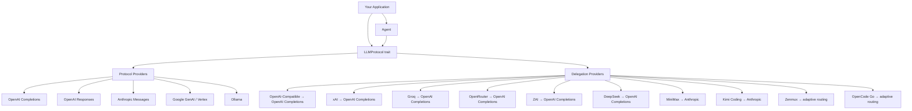

<div align="center">

# tiycore

**Unified LLM API and stateful Agent runtime in Rust**

[](https://opensource.org/licenses/MIT)
[](https://www.rust-lang.org/)
[](https://github.com/tiylabs/tiycore)

[English](./README.md) | [中文](./README-ZH.md)

</div>

---

tiycore is a Rust library that provides a single, provider-agnostic interface for streaming LLM completions and running agentic tool-use loops. Write your application logic once, then swap between OpenAI, Anthropic, Google, Ollama, and 8+ other providers by changing a config value.


## Highlights

- **One interface, many providers** — 5 protocol-level implementations (OpenAI Completions, OpenAI Responses, Anthropic Messages, Google Generative AI / Vertex AI, Ollama) and 10 delegation providers (OpenAI-Compatible, xAI, Groq, OpenRouter, DeepSeek, MiniMax, Kimi Coding, ZAI, Zenmux, OpenCode Go) behind a single `LLMProtocol` trait.
- **Streaming-first** — `EventStream<T, R>` backed by `parking_lot::Mutex<VecDeque>` + `tokio::sync::Notify` implements `futures::Stream`. Every provider returns an `AssistantMessageEventStream` with fine-grained deltas: text, thinking, tool call arguments, and completion events.
- **Tool / Function calling** — Define tools via JSON Schema, validate arguments with the `jsonschema` crate, and execute tools in parallel or sequentially within the agent loop.
- **Stateful Agent runtime** — `Agent` manages a full conversation loop: stream LLM → detect tool calls → execute tools → re-prompt → repeat. Supports steering (interrupt mid-turn), follow-up queues, event subscription (observer pattern), abort, configurable max turns (default 25), and standalone loop helpers when you want the same runtime without a long-lived `Agent` instance.
- **Extended Thinking** — Provider-specific thinking/reasoning support with a unified `ThinkingLevel` enum (Off → XHigh, supporting OpenAI GPT-5 and Anthropic Opus 4.7+) and `ThinkingDisplay` enum (`Summarized` / `Omitted`) controlling whether thinking content is included in responses. Cross-provider thinking block conversion is handled automatically during message transformation.
- **Thread-safe by default** — All mutable state uses `parking_lot` locks and `AtomicBool` for non-poisoning concurrency.

## Architecture



### Core Layers

| Layer | Path | Purpose |
|---|---|---|
| **Types** | `src/types/` | Provider-agnostic data model: `Message`, `ContentBlock`, `Model`, `Tool`, `Context`, `SecurityConfig` |
| **Protocol** | `src/protocol/` | Wire-format implementations ([full docs](./src/protocol/README.md)) |
| **Provider** | `src/provider/` | Service vendor facades ([full docs](./src/provider/README.md)) |
| **Stream** | `src/stream/` | Generic `EventStream<T, R>` implementing `futures::Stream` |
| **Agent** | `src/agent/` | Stateful conversation manager with tool execution loop ([full docs](./src/agent/README.md)) |
| **Transform** | `src/transform/` | Cross-provider message transformation (thinking blocks, tool call IDs, orphan resolution) |
| **Thinking** | `src/thinking/` | `ThinkingLevel` enum, `ThinkingDisplay` enum, and provider-specific thinking options |
| **Validation** | `src/validation/` | JSON Schema validation for tool parameters |
| **Models** | `src/models/` | `ModelRegistry` with predefined models (GPT-4o, Claude Sonnet 4, Gemini 2.5 Flash, etc.) |
| **Catalog** | `src/catalog/` | Native model listing, snapshot refresh, scheduled snapshot generation, and optional metadata enrichment for display ([full docs](./src/catalog/README.md)) |

## Catalog Snapshot Generation

The repository publishes a catalog snapshot through a scheduled GitHub Actions workflow defined in `.github/workflows/catalog-pages.yml`. That workflow runs `cargo run --bin tiy-catalog-sync -- ...`, fetches upstream model metadata, builds a normalized snapshot, and writes the generated files to `dist/catalog/`.

Before the snapshot is written, `tiy-catalog-sync` loads `catalog/patches.json` and applies repository-managed data fixes to the fetched `CatalogModelMetadata` records. This patch layer is intended for correcting known upstream metadata errors in the generated catalog artifact itself rather than exposing a runtime override API to downstream applications.

For example, if an upstream provider reports an incorrect context window for a model, the patch file can override that value during snapshot generation so the published `catalog.json` already contains the corrected metadata. The repository currently uses this mechanism to fix OpenRouter's `z-ai/glm-5` context window from `80_000` to `200_000`.

## Quick Start

Add the dependency to your `Cargo.toml`:

```toml
[dependencies]
tiycore = "0.1.0"
tokio = { version = "1", features = ["full"] }
futures = "0.3"
```

For local development before publishing, you can still use:

```toml
[dependencies]
tiycore = { path = "../tiycore" }
```

### Streaming Completion

```rust
use futures::StreamExt;
use tiycore::{
    provider::get_provider,
    types::*,
};

#[tokio::main]
async fn main() {
    // Build a model
    let model = Model::builder()
        .id("gpt-4o-mini")
        .name("GPT-4o Mini")
        .provider(Provider::OpenAI)
        .context_window(128000)
        .max_tokens(16384)
        .build()
        .unwrap();

    // Create a context with messages
    let context = Context {
        system_prompt: Some("You are a helpful assistant.".to_string()),
        messages: vec![Message::User(UserMessage::text("What is the capital of France?"))],
        tools: None,
    };

    // Resolve provider from model and stream the response
    // (providers are auto-registered on first access — no manual setup needed)
    let provider = get_provider(&model.provider).unwrap();
    let options = StreamOptions {
        api_key: Some(std::env::var("OPENAI_API_KEY").unwrap()),
        ..Default::default()
    };
    let mut stream = provider.stream(&model, &context, options);

    while let Some(event) = stream.next().await {
        match event {
            AssistantMessageEvent::TextDelta { delta, .. } => print!("{delta}"),
            AssistantMessageEvent::Done { message, .. } => {
                println!("\n--- {} input, {} output tokens ---",
                    message.usage.input, message.usage.output);
            }
            AssistantMessageEvent::Error { error, .. } => {
                eprintln!("Error: {:?}", error.error_message);
            }
            _ => {}
        }
    }
}
```

### Agent with Tool Calling

```rust
use tiycore::{
    agent::{Agent, AgentTool, AgentToolResult},
    types::*,
};

#[tokio::main]
async fn main() {
    let agent = Agent::with_model(
        Model::builder()
            .id("gpt-4o-mini").name("GPT-4o Mini")
            .provider(Provider::OpenAI)
            .context_window(128000).max_tokens(16384)
            .build().unwrap(),
    );

    agent.set_api_key(std::env::var("OPENAI_API_KEY").unwrap());
    agent.set_system_prompt("You are a helpful assistant with access to tools.");
    agent.set_tools(vec![AgentTool::new(
        "get_weather", "Get Weather", "Get current weather for a city",
        serde_json::json!({
            "type": "object",
            "properties": { "city": { "type": "string" } },
            "required": ["city"]
        }),
    )]);
    agent.set_tool_executor_simple(|name, _id, args| {
        let name = name.to_string();
        let args = args.clone();
        async move {
            match name.as_str() {
                "get_weather" => {
                    let city = args["city"].as_str().unwrap_or("unknown");
                    AgentToolResult::text(format!("Weather in {city}: 22°C, sunny"))
                }
                _ => AgentToolResult::error(format!("Unknown tool: {name}")),
            }
        }
    });

    // The agent loops automatically: LLM → tool calls → execute → re-prompt → done
    let messages = agent.prompt("What's the weather in Tokyo?").await.unwrap();
    println!("Agent produced {} messages", messages.len());
}
```

The Agent also supports hooks (beforeToolCall / afterToolCall / onPayload), context pipeline (transformContext / convertToLlm), preserved tool-result `details` overrides, event subscription with prompt/tool-result lifecycle events, steering & follow-up queues, thinking budgets, custom HTTP headers (`custom_headers` on `AgentConfig`), standalone loop helpers, custom messages, and more. See the full **[Agent Module Documentation](./src/agent/README.md)** for details.

## Supported Providers

| Provider | Type | Env Var |
|---|---|---|
| OpenAI | Direct | `OPENAI_API_KEY` |
| Anthropic | Direct | `ANTHROPIC_API_KEY` |
| Google | Direct | `GOOGLE_API_KEY` |
| Ollama | Direct | — |
| OpenAI-Compatible | Delegation → OpenAI Completions | `OPENAI_API_KEY` |
| xAI | Delegation → OpenAI Completions | `XAI_API_KEY` |
| Groq | Delegation → OpenAI Completions | `GROQ_API_KEY` |
| OpenRouter | Delegation → OpenAI Completions | `OPENROUTER_API_KEY` |
| ZAI | Delegation → OpenAI Completions | `ZAI_API_KEY` |
| DeepSeek | Delegation → OpenAI Completions | `DEEPSEEK_API_KEY` |
| MiniMax | Delegation → Anthropic | `MINIMAX_API_KEY` |
| Kimi Coding | Delegation → Anthropic | `KIMI_API_KEY` |
| Zenmux | Adaptive multi-protocol | `ZENMUX_API_KEY` |
| OpenCode Go | Adaptive multi-protocol | `OPENCODE_GO_API_KEY` |

For detailed provider configuration, compat flags, Zenmux adaptive routing, and how to add new providers, see the **[Provider Documentation](./src/provider/README.md)**.

For wire-format protocol internals (SSE parsing, request building, delegation macros), see the **[Protocol Documentation](./src/protocol/README.md)**.

## Publishing

To make downstream projects depend on `tiycore` without a Git URL, publish the crate to crates.io and then depend on it by version:

```bash
cargo login
cargo package
cargo publish
```

After publishing, consumers can keep using:

```toml
[dependencies]
tiycore = "0.1.0"
```

## API Key Resolution

Keys are resolved in priority order:

1. `StreamOptions.api_key` (per-request override)
2. Provider's `default_api_key()` method
3. Environment variable (e.g. `OPENAI_API_KEY`, `ANTHROPIC_API_KEY`)

Base URLs follow the same pattern: `StreamOptions.base_url` > `model.base_url` > provider's `DEFAULT_BASE_URL`.

## Request Retry Behavior

Protocol-layer retries are enabled for transient failures before the stream has emitted any semantic output. By default, the library retries `408`, `429`, `500`, `502`, `503`, and `504`, as well as transport errors reported by `reqwest` as `is_timeout()` or `is_connect()`.

When a provider returns `Retry-After`, the retry delay respects that value. `max_retry_delay_ms` acts as a cap for server-requested or computed backoff delays, and `Some(0)` disables the cap entirely.

Once a stream has already emitted semantic events such as text deltas, thinking deltas, or tool-call deltas, the protocol layer stops retrying transparently and terminates the stream with an error instead. This avoids duplicating partial output or replaying tool side effects.

You can control retries per request using `StreamOptions.max_retries` and `StreamOptions.max_retry_delay_ms`, or at the Agent level using `Agent::set_max_retries` and `Agent::set_max_retry_delay_ms`.

## Security Configuration

tiycore ships with a centralized `SecurityConfig` struct that controls all security limits and policies. Every field has a safe default value — you only need to override what you want to change.

### Enabling Security Config

**In code (programmatic):**

```rust
use tiycore::types::{SecurityConfig, HttpLimits, AgentLimits, StreamOptions};

// Method 1: Use defaults (zero-config)
let options = StreamOptions::default();
// options.security is None → all defaults apply automatically

// Method 2: Override specific values
let security = SecurityConfig::default()
    .with_http(HttpLimits {
        connect_timeout_secs: 10,
        request_timeout_secs: 600,
        ..Default::default()
    })
    .with_agent(AgentLimits {
        max_messages: 500,
        max_parallel_tool_calls: 8,
        ..Default::default()
    });

let options = StreamOptions {
    api_key: Some("sk-...".to_string()),
    security: Some(security),
    ..Default::default()
};
```

**From a JSON config file:**

```rust
use tiycore::types::SecurityConfig;

// Load from file — only specified fields are overridden, rest use defaults
let json = std::fs::read_to_string("security.json").unwrap();
let security: SecurityConfig = serde_json::from_str(&json).unwrap();
```

**From a TOML config file (requires `toml` crate):**

```rust
let toml_str = std::fs::read_to_string("security.toml").unwrap();
let security: SecurityConfig = toml::from_str(&toml_str).unwrap();
```

### JSON Configuration Reference

A full `security.json` with all fields and their defaults:

```jsonc
{
  // HTTP client and SSE stream parsing limits (applied per provider request)
  "http": {
    "connect_timeout_secs": 30,           // TCP connect timeout
    "request_timeout_secs": 1800,         // Total request timeout including streaming (30 min)
    "max_sse_line_buffer_bytes": 2097152, // SSE line buffer cap, prevents OOM (2 MiB)
    "max_error_body_bytes": 65536,        // Max error response body to read (64 KiB)
    "max_error_message_chars": 4096       // Max error message length stored in events
  },

  // Agent runtime limits
  "agent": {
    "max_messages": 1000,                 // Conversation history cap (0 = unlimited, FIFO eviction)
    "max_parallel_tool_calls": 16,        // Concurrent tool execution limit
    "tool_execution_timeout_secs": 120,   // Per-tool execution timeout (2 min)
    "validate_tool_calls": true,          // Validate tool args against JSON Schema before execution
    "max_subscriber_slots": 128           // Max event subscriber slots
  },

  // EventStream infrastructure limits
  "stream": {
    "max_event_queue_size": 10000,        // Event buffer cap (0 = unlimited)
    "result_timeout_secs": 600            // EventStream::result() blocking timeout (10 min)
  },

  // Header security policy — prevents custom headers from overriding auth headers
  "headers": {
    "protected_headers": [
      "authorization",
      "x-api-key",
      "x-goog-api-key",
      "anthropic-version",
      "anthropic-beta"
    ]
  },

  // Base URL validation policy (SSRF protection)
  "url": {
    "require_https": true,                // Enforce HTTPS (localhost/127.0.0.1 exempted)
    "block_private_ips": false,           // Block private/loopback IPs (off for local dev)
    "allowed_schemes": ["https", "http"], // Allowed URL schemes
    "https_exempt_hosts": []              // Hosts exempt from HTTPS requirement (e.g. [".oa.com", "llm.internal"])
  }
}
```

> **Partial overrides:** You only need to include the fields you want to change. Omitted fields and entire sections fall back to their defaults. For example, `{}` gives you all defaults, and `{"http": {"connect_timeout_secs": 10}}` only changes the connect timeout.

### TOML Configuration Reference

The same config in TOML format:

```toml
[http]
connect_timeout_secs = 30
request_timeout_secs = 1800
max_sse_line_buffer_bytes = 2097152
max_error_body_bytes = 65536
max_error_message_chars = 4096

[agent]
max_messages = 1000
max_parallel_tool_calls = 16
tool_execution_timeout_secs = 120
validate_tool_calls = true
max_subscriber_slots = 128

[stream]
max_event_queue_size = 10000
result_timeout_secs = 600

[headers]
protected_headers = [
  "authorization",
  "x-api-key",
  "x-goog-api-key",
  "anthropic-version",
  "anthropic-beta",
]

[url]
require_https = true
block_private_ips = false
allowed_schemes = ["https", "http"]
https_exempt_hosts = []
```

### Default Values Quick Reference

| Section | Field | Default | Description |
|---|---|---|---|
| **http** | `connect_timeout_secs` | `30` | TCP connect timeout |
| | `request_timeout_secs` | `1800` | Total request timeout (30 min) |
| | `max_sse_line_buffer_bytes` | `2097152` | SSE buffer cap (2 MiB) |
| | `max_error_body_bytes` | `65536` | Error body read cap (64 KiB) |
| | `max_error_message_chars` | `4096` | Error message truncation |
| **agent** | `max_messages` | `1000` | History cap (0 = unlimited) |
| | `max_parallel_tool_calls` | `16` | Parallel tool exec limit |
| | `tool_execution_timeout_secs` | `120` | Per-tool timeout (2 min) |
| | `validate_tool_calls` | `true` | JSON Schema validation |
| | `max_subscriber_slots` | `128` | Subscriber slots |
| **stream** | `max_event_queue_size` | `10000` | Event queue cap (0 = unlimited) |
| | `result_timeout_secs` | `600` | Result blocking timeout (10 min) |
| **headers** | `protected_headers` | `["authorization", ...]` | Cannot be overridden |
| **url** | `require_https` | `true` | HTTPS enforced (localhost exempt) |
| | `block_private_ips` | `false` | Private IP blocking |
| | `allowed_schemes` | `["https", "http"]` | Allowed URL schemes |
| | `https_exempt_hosts` | `[]` | Hosts exempt from HTTPS (supports suffix match with leading dot) |

## Build & Test

```bash
cargo build                          # Build the library
cargo test                           # Run all tests
cargo test test_agent_state_new      # Run a single test by name
cargo test -- --nocapture            # Show test output
cargo fmt                            # Format code
cargo clippy                         # Lint

# Run examples (requires API keys)
cargo run --example basic_usage
cargo run --example agent_example
```

## Project Structure

```
src/
├── lib.rs              # Crate root, public re-exports
├── types/              # Provider-agnostic data model
│   ├── model.rs        # Model, Provider, Api (via define_string_enum! macro), Cost, OpenAICompletionsCompat (CompatCapabilities, CompatThinking, CompatMessageFormat)
│   ├── message.rs      # Message (User/Assistant/ToolResult), StopReason
│   ├── content.rs      # ContentBlock (Text/Thinking/ToolCall/Image)
│   ├── context.rs      # Context, Tool, StreamOptions
│   ├── limits.rs       # SecurityConfig, HttpLimits, AgentLimits, StreamLimits, UrlPolicy, HeaderPolicy
│   ├── events.rs       # AssistantMessageEvent (streaming events)
│   └── usage.rs        # Token usage tracking
├── protocol/           # Wire-format protocol implementations (README.md)
│   ├── traits.rs       # LLMProtocol trait
│   ├── registry.rs     # Global ProtocolRegistry
│   ├── common.rs       # Shared infrastructure (URL resolution, payload hooks, error handling)
│   ├── delegation.rs   # Macros for generating delegation providers
│   ├── openai_completions.rs  # OpenAI Chat Completions protocol
│   ├── openai_responses.rs    # OpenAI Responses API protocol
│   ├── anthropic.rs    # Anthropic Messages protocol
│   └── google.rs       # Google GenAI + Vertex AI (dual-mode)
├── provider/           # Service vendor facades (README.md)
│   ├── openai.rs       # OpenAI → protocol::openai_responses
│   ├── anthropic.rs    # Anthropic → protocol::anthropic
│   ├── google.rs       # Google → protocol::google
│   ├── ollama.rs       # Ollama → protocol::openai_completions
│   ├── xai.rs          # Delegation → OpenAI Completions
│   ├── groq.rs         # Delegation → OpenAI Completions
│   ├── openrouter.rs   # Delegation → OpenAI Completions
│   ├── zai.rs          # Delegation → OpenAI Completions
│   ├── minimax.rs      # Delegation → Anthropic
│   ├── kimi_coding.rs  # Delegation → Anthropic
│   ├── zenmux.rs       # Adaptive 3-way routing
│   └── opencode_go.rs # Adaptive multi-protocol routing
├── catalog/
│   ├── README.md       # Catalog fetch/enrichment/snapshot documentation
│   └── mod.rs          # Native model listing + snapshot refresh + metadata stores
├── stream/
│   └── event_stream.rs # Generic EventStream<T, R> + AssistantMessageEventStream
├── agent/
│   ├── README.md      # Full Agent module documentation
│   ├── agent.rs        # Agent loop: stream → tools → re-prompt
│   ├── state.rs        # Thread-safe AgentState
│   └── types.rs        # AgentConfig, AgentEvent, AgentTool, AgentHooks, ToolExecutor, ToolExecutionMode
├── transform/
│   ├── messages.rs     # Thinking block conversion, orphan tool call handling
│   └── tool_calls.rs   # Tool call ID normalization
├── thinking/
│   └── config.rs       # ThinkingLevel, provider-specific options
├── validation/
│   └── tool_validation.rs # JSON Schema validation for tool args
└── models/
    ├── mod.rs           # ModelRegistry + global predefined models
    └── predefined.rs
```

## License

[MIT](https://opensource.org/licenses/MIT)
